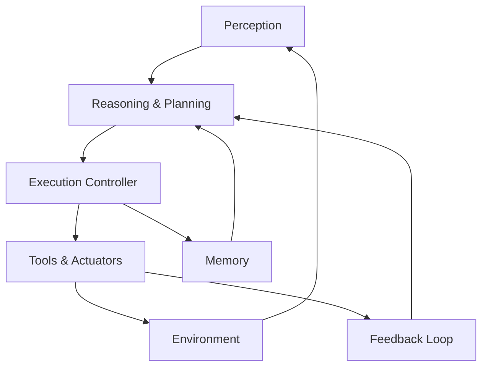
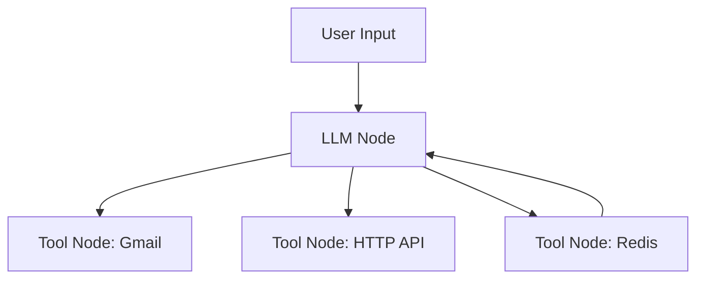

# The Rise of AI Agents

## Overview

This document explores the evolution, design, and development of AI agents, focusing on both low-code (n8n) and code-first (LangChain + Python) implementations. The narrative walks through the differences between chatbots and true autonomous agents, the emergence of "agentic AI," and how to build such agents with practical examples.

---

## Table of Contents

1. What is an AI Agent?
2. What is an Environment in AI Agents?
3. AI Agent vs Traditional Software
4. Rise of Agentic AI
5. AI Agent vs Agentic AI
6. Classic vs Modern AI Agents
7. Components of an AI Agent
8. Architecting Modern Agents
9. Building Agents with n8n
10. Building Agents with LangChain + Python
11. Agent as Human-like Department (Analogy)
12. Comparing AI Agent to HR Department
13. Future of AI Agents
14. Code Samples

---

## 1. What is an AI Agent?

An AI Agent is a software system that:

- Observes inputs (text, data, APIs)
- Plans intelligently based on goals
- Takes actions autonomously
- Optionally remembers past context
- Learns from outcomes or feedback

AI Agents are not just reactive — they are proactive, adaptive, and capable of tool use.

---

## 2. What is an Environment in AI Agents?

In the context of AI agents, an environment refers to:

- The world or system the agent interacts with
- Includes external systems, APIs, databases, UIs, user inputs, and sensors
- Defined by perceptible states and possible actions

Agents perceive their environment, make decisions based on that perception, and perform actions that may affect the environment.

Examples:

- A chatbot's environment = user input text + knowledge base
- A warehouse robot's environment = location, shelves, obstacles
- An AI Ops agent's environment = log streams, CPU metrics, alerts

---

## 3. AI Agent vs Traditional Software

| Traditional Software | AI Agent                    |
| -------------------- | --------------------------- |
| Rule-based           | Goal-based reasoning        |
| Reactive UI          | Can initiate actions        |
| Stateless            | Can retain context          |
| Deterministic        | Probabilistic / fuzzy logic |

---

## 4. Rise of Agentic AI

Agentic AI refers to the design pattern where AI systems possess "agency" — the ability to independently decide, plan, and act. Key attributes include:

- Goal setting and decomposition
- Tool use
- Proactivity
- Autonomy

Quotable definition:

> "Agentic AI is defined as systems that can plan autonomously and take actions to meet goals." — Tom Coshow, Gartner

---

## 5. AI Agent vs Agentic AI

| Concept    | AI Agent                    | Agentic AI Framework   |
| ---------- | --------------------------- | ---------------------- |
| Definition | A task-performing AI entity | Philosophy of autonomy |
| Scope      | Implementation-level        | Design-level paradigm  |
| Behavior   | Often reactive              | Proactive + planning   |
| Tool use   | Manual or prompted          | Goal-driven & fluent   |
| Memory     | Optional                    | Core design element    |

---

## 6. Classic vs Modern AI Agents

Classical Agents:

- Simple Reflex
- Model-Based Reflex
- Goal-Based
- Utility-Based
- Learning Agents

Modern AI Agents:

- Use LLMs for planning
- Integrate APIs, tools, and databases
- Feature persistent memory
- Are capable of multi-step reasoning

---

## 7. Components of an AI Agent

| Component             | Description                                                                 |
|----------------------|-----------------------------------------------------------------------------|
| Perception Layer     | Gathers input from environment (text, images, API responses, sensors)        |
| Reasoning & Planning | Decides next action using logic, LLMs, or symbolic methods                   |
| Memory               | Retains context or knowledge (session, vector DBs, or persistent stores)     |
| Tools & Actuators    | Executes actions via APIs, commands, file system, or web automation          |
| Execution Controller | Orchestrates steps, flow, and handles planning strategies                    |
| Feedback Loop        | Evaluates results, logs behavior, optionally enables learning                |



---

## 8. Architecting Modern Agents

Modules:

- Input / Perception (text, API, sensor)
- Planning & Decision Engine (LLM or logic)
- Memory (short or long-term)
- Tools (APIs, functions, plugins)
- Action / Execution
- Feedback / Logging

---

## 9. Building Agents with n8n (No-Code)

n8n enables visual workflows:

- Brain: LLM node (OpenAI, Claude, etc.)
- Prompt: Role definition and behavior
- Memory: Store variables, use Redis
- Tools: Gmail, HTTP request, Slack, etc.

Structure:

- User input → LLM Node → Tool Nodes
- Add memory loop for conversation retention



---

## 10. Building Agents with LangChain + Python

LangChain is a modular Python framework for building AI apps with:

- LLM orchestration
- Prompt templates
- Memory
- Custom tools
- Agent Executors

Key Concepts:

- LLM: Brain of the agent
- Tool: A function the agent can call
- AgentType: Defines reasoning strategy
- Memory: Keeps context

### Agent Types:

- ZeroShotReactDescription
- ReAct
- PlanAndExecute

### Tool Example:

```python
from langchain.tools import Tool

tool = Tool(
  name="Search",
  func=my_google_search,
  description="Use this to find information online"
)
```

### Memory Example:

```python
from langchain.memory import ConversationBufferMemory

memory = ConversationBufferMemory()
```

### Full Agent Example:

```python
from langchain.agents import initialize_agent, AgentType
from langchain.llms import OpenAI

llm = OpenAI(temperature=0)
agent = initialize_agent(
    tools=[tool],
    llm=llm,
    agent=AgentType.ZERO_SHOT_REACT_DESCRIPTION,
    memory=memory
)

result = agent.run("What is the GDP of Japan divided by 3?")
print(result)
```

---

## 11. Agent as Human-like Department (Analogy)

Think of an AI Agent as a digital version of a human department:

- The Agent's environment is the company workspace
- It receives inputs (emails, calendar invites, logs)
- It decides actions (schedule meeting, send report, update record)
- It executes via tools (APIs, integrations, databases)

🧠 Example: A Recruiting Agent
- Input: new applicant email
- Memory: history of past interviews
- Reasoning: match job description to CV
- Action: schedule interview, notify hiring manager

Like a skilled HR representative — fast, tireless, and goal-oriented.

---

## 12. Comparing AI Agent to HR Department

| HR Department Task         | AI Agent Behavior                                               |
|----------------------------|------------------------------------------------------------------|
| Reads incoming resumes     | Scans inputs via text embeddings                                 |
| Matches candidate to job   | Uses goal-oriented filtering logic                               |
| Schedules interviews       | Calls calendar APIs, picks open slots                            |
| Emails confirmations       | Automates email workflow using SMTP or Gmail API                 |
| Logs candidate feedback    | Writes context to memory (Chroma, Redis, etc.)                   |
| Reports to hiring manager  | Generates status reports, sends Slack/email summaries            |

This analogy helps demystify AI Agents as “digital departments” capable of meaningful autonomous work.

---

## 13. Future of AI Agents

- Multi-agent collaboration
- Autonomous microservices
- Agent marketplaces
- Embedded agents in every SaaS tool
- Regulatory and ethical constraints

---

## 14. Key Takeaways

- AI Agents are more than chatbots
- Agentic AI is a design shift — not just a tool
- Tools like n8n and LangChain make this accessible today
- Every software team can benefit from delegation to AI Agents

---


